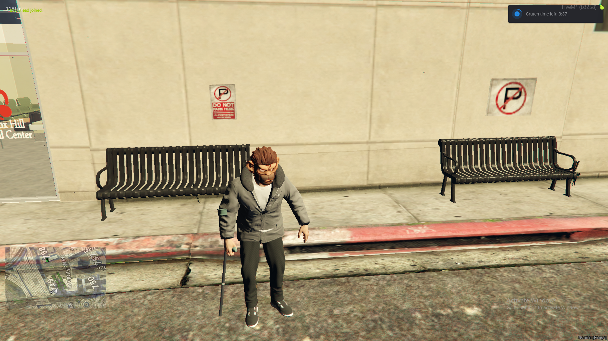

# core-crutches

This is my first release and I made a crutch system that: 
- Allows ems or admins to apply a crutch to players who have been injured.
- Crutched players walk with a limp, crutch prop, and cannot jump or run.
- Persists across reload skin and re-log. 
- All done via a command /applycrutch [id] [time] , Ems or Admin only.
- Registers a command for players /crutchtime to check how much time they have left.
- Registers a useable item 'crutch' that will un-crutch the player.

I thought this was perfect as a money sink or to slow down the flow of instant recovery, and consequence free actions.

This is also availible on my tebex: 
[https://core-forge.tebex.io/](https://core-forge.tebex.io/package/7240624)

Github profile:
[Github Profile](https://github.com/Core-Forge-5)

Github repo:
[Github](https://github.com/Core-Forge-5/core-crutches)