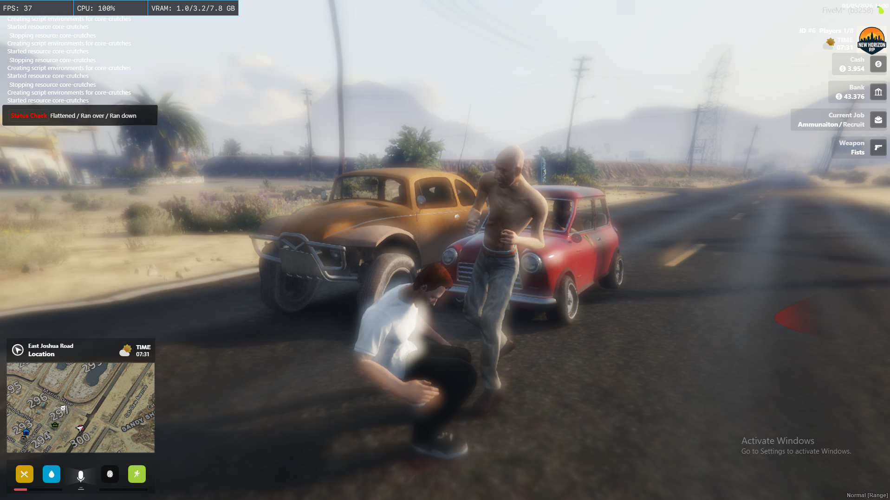
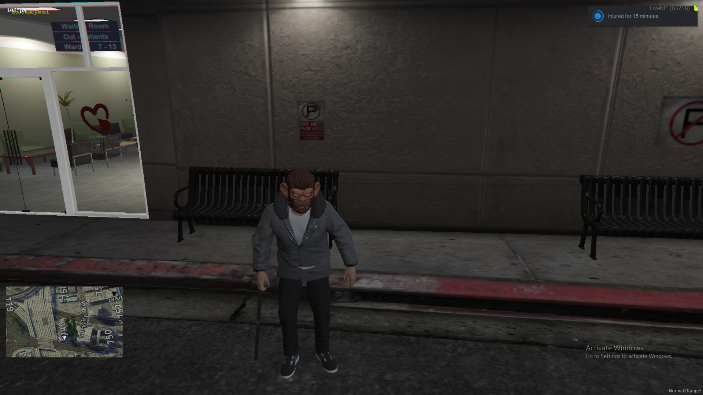
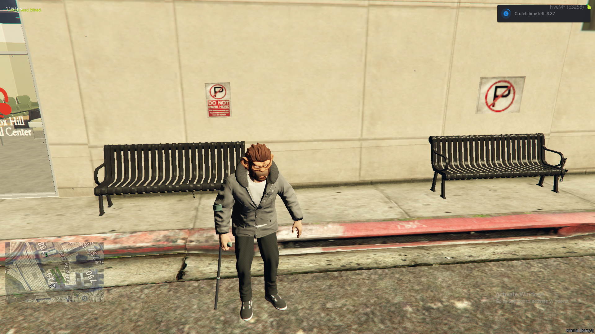
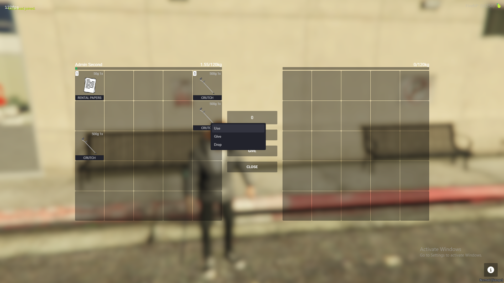
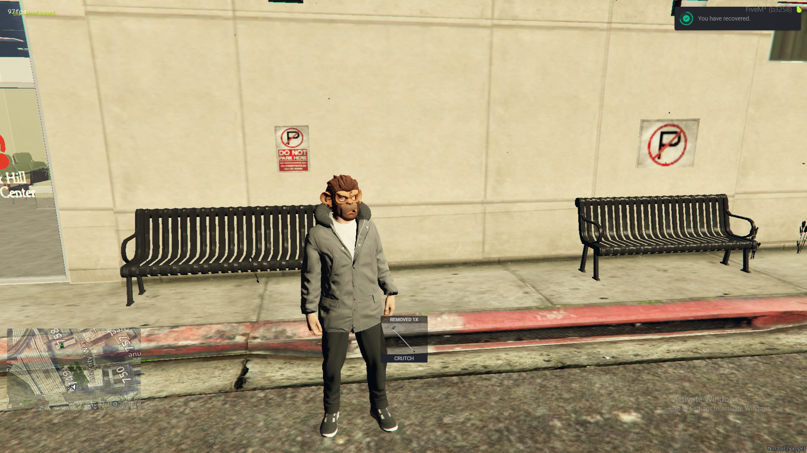

# core-crutches

This is my first release and I made a crutch system that:

- Allows ems or admins to apply a crutch to players who have been injured.
- Crutched players walk with a limp, crutch prop, and cannot jump or run.
- Persists across reload skin and re-log.
- All done via a command /applycrutch [id] [time] , Ems or Admin only.
- Registers a command for players /crutchtime to check how much time they have left.
- Registers a useable item 'crutch' that will un-crutch the player.

I thought this was perfect as a money sink or to slow down the flow of instant recovery, and consequence free actions.

## Knockout

- I added a knockout feature

```lua
Config.Knockout.Enabled = true --Bool:  Enables/Disables the knockout script
Config.Knockout.Duration = 5500 --Integer:  MS How long the knockout lasts for
Config.Knockout.HealthAmount = 155 --Integer:  100-200 At what health level will they be knocked out 100 is 0 and 200 is full
Config.Knockout.RegenInterval = 450 --Integer:  MS Time between health regenerations
Config.Knockout.Regeneration = 2 --Integer:  How much health to give each RegenInterval
```



## Crutches

- Applying

- Checking Crutch Time

- Using The Crutch Item

- After Use


This is also availible on my tebex:
[https://core-forge.tebex.io/](https://core-forge.tebex.io/package/7240624)

Github profile:
[Github Profile](https://github.com/Core-Forge-5)

Github repo:
[Github](https://github.com/Core-Forge-5/core-crutches)
